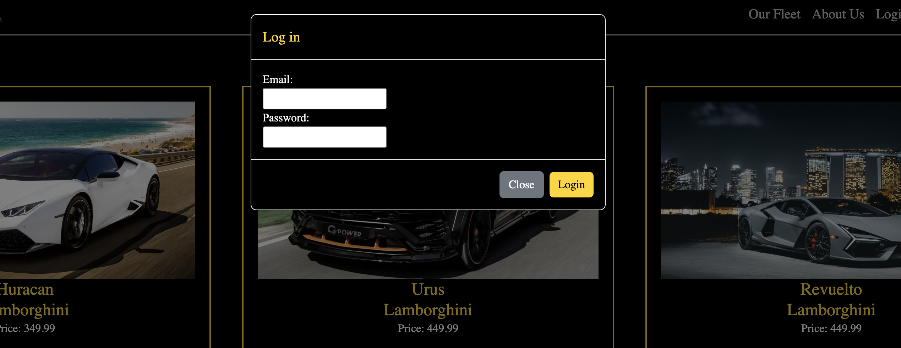

# 404_Project_2
<div align="center">

[](https://opensource.org/licenses/MIT)
[](https://github.com/ParryProgramming/404_Project_2/graphs/contributors)
[](https://github.com/ParryProgramming/404_Project_2/network/members)
[](https://github.com/ParryProgramming/404_Project_2/stargazers)
[](https://github.com/ParryProgramming/404_Project_2/issues)
[](https://linkedin.com/in/Wartech93)

</div>


<div align="center">
  <a href="https://github.com/ParryProgramming/404_Project_2">
    
  </a>

  <h3 align="center">404_Project_2</h3>

  <p align="center">
    Brought to you Royce Atkins, Alberto Lawant, Val Spadoni and Christian Abbate.<br />
    <a href="https://github.com/ParryProgramming/404_Project_2"><strong>Explore the docs »</strong></a>
    <br />
    <br />
    <!-- TODO- add deployed link -->
    <a href="https://github.com/ParryProgramming/404_Project_2">View Demo(Coming Soon)</a>
    ·
    <a href="https://github.com/ParryProgramming/404_Project_2/issues">Report Bug</a>
    ·
    <a href="https://github.com/ParryProgramming/404_Project_2/issues">Request Feature</a>

  </p>
</div>

<!-- TABLE OF CONTENTS -->
<details>
  <summary>Table of Contents</summary>
  <ol>
    <li>
      <a href="#about-the-project">About The Project</a>
      <ul>
        <li><a href="#built-with">Built With</a></li>
      </ul>
    </li>
    <li>
      <a href="#getting-started">Getting Started</a>
      <ul>
        <li><a href="#installation">Installation</a></li>
      </ul>
    </li>
    <li><a href="#usage">Usage</a></li>
    <li><a href="#roadmap">Roadmap</a></li>
    <li><a href="#contributing">Contributing</a></li>
    <li><a href="#license">License</a></li>
    <li><a href="#contact">Contact</a></li>
    <li><a href="#acknowledgments">Acknowledgments</a></li>
  </ol>
</details>

## About The Project

This project was built with Node.js, Express.js, Handlebars.js, PostgreSQL and Sequelize ORM. 

We created an application that allows you to view and reserve luxury cars. It also gives users the ability to create an account so they can save their favorite vehicles for future reservations.

### Built With

<div align="center">


<!-- GETTING STARTED -->

## Getting Started

Once completely built, this application will function as a deployed app on Render

### Local Installation / Testing

1. Clone the repository:

```
git clone https://github.com/ParryProgramming/404_Project_2.git
```

2. Log into your PostgresSQL server:

```
psql -U postgres
```

3. Verify the database creation by running the command:

```
\i schema.sql
```

4. Navigate to the folder containing the server.js file. Run the following commands:

```
$ npm run seed
$ node server.js
```

## Screenshots




## Contributing

Contributions are what make the open source community such an amazing place to learn, inspire, and create. Any contributions you make are **greatly appreciated**.

If you have a suggestion that would make this better, please fork the repo and create a pull request. You can also simply open an issue with the tag "enhancement".
Don't forget to give the project a star! Thanks again!

1. Fork the Project
2. Create your Feature Branch (git checkout -b feature/AmazingFeature)
3. Commit your Changes (git commit -m 'Add some AmazingFeature')
4. Push to the Branch (git push origin feature/AmazingFeature)
5. Open a Pull Request


## License

This project is licensed under the MIT license.

See LICENSE.txt for more information.


## Contact

[Mary Elenius](https://maryelenius.com/d20) - mary.panda.jackson@gmail.com


[Cody Chase](https://github.com/Wartech93) - [TODO- cody's email will go here]

Project Links:


[Figma Board- link later]()

[Github Repository](https://github.com/ParryProgramming/404_Project_2)


[Deployment- link later]()


## Acknowledgments

Mary would like to give a big shoutout to my partner in crime and daughter, Yennefer! Every day she proves she is small yet mighty! She would also like to thank all of her students in the Spring 2024 UCF Full Stack Bootcamp for being a fantastic cohort!